# Java Performance Tuning
This repo holds:
- MCQs for Java deep dives
- <a href="./src/multithreading/VISUAL_VM.md">Thread Profiling Using VirtualVM</a>
  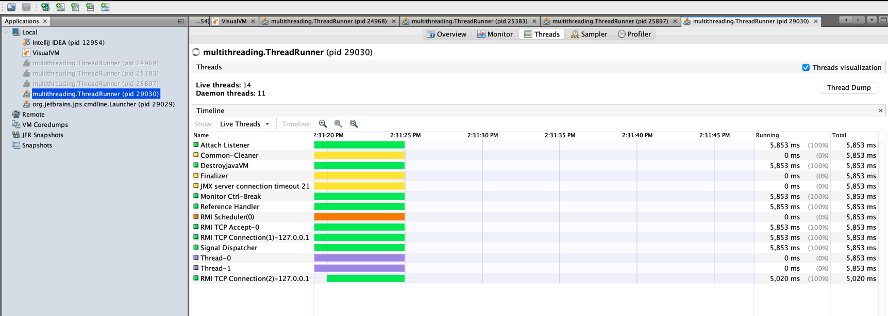
- <a href="./assets/pdfs/JavaPerformanceTuning.pdf">GC and Heap PDF</a>

=======

* JMX : JMX (Java Management Extensions) is a technology used for monitoring and managing Java applications, facilitating tasks like performance monitoring, configuration management, and remote control through standardized interfaces and components.
* RMI: RMI (Remote Method Invocation) is a Java API allowing communication between Java objects in different JVMs over a network, enabling distributed application development.
* javaw: `w` stands for windowed. It is a tool used to run Java applications without showing a command prompt window. It's handy for applications with graphical interfaces or background services that don't need a visible console.

=======

## Memory Model
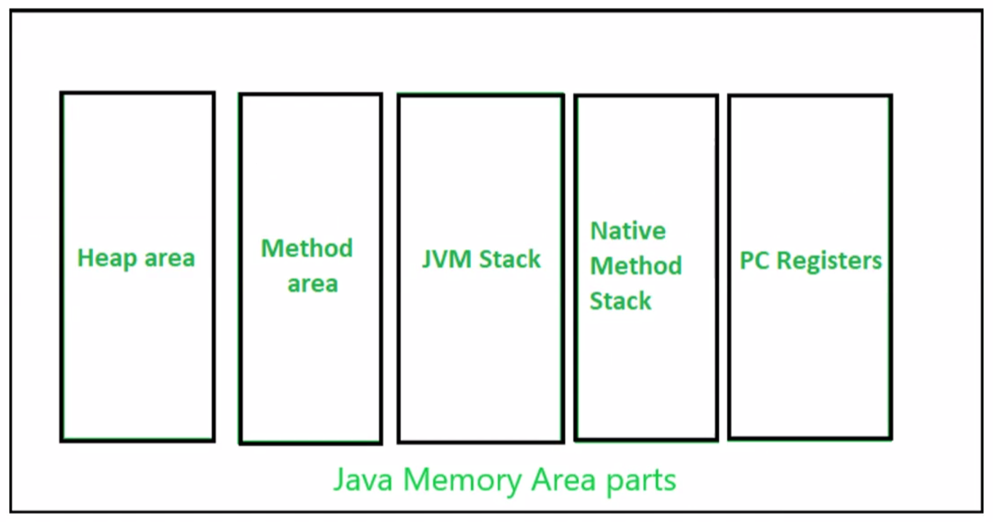

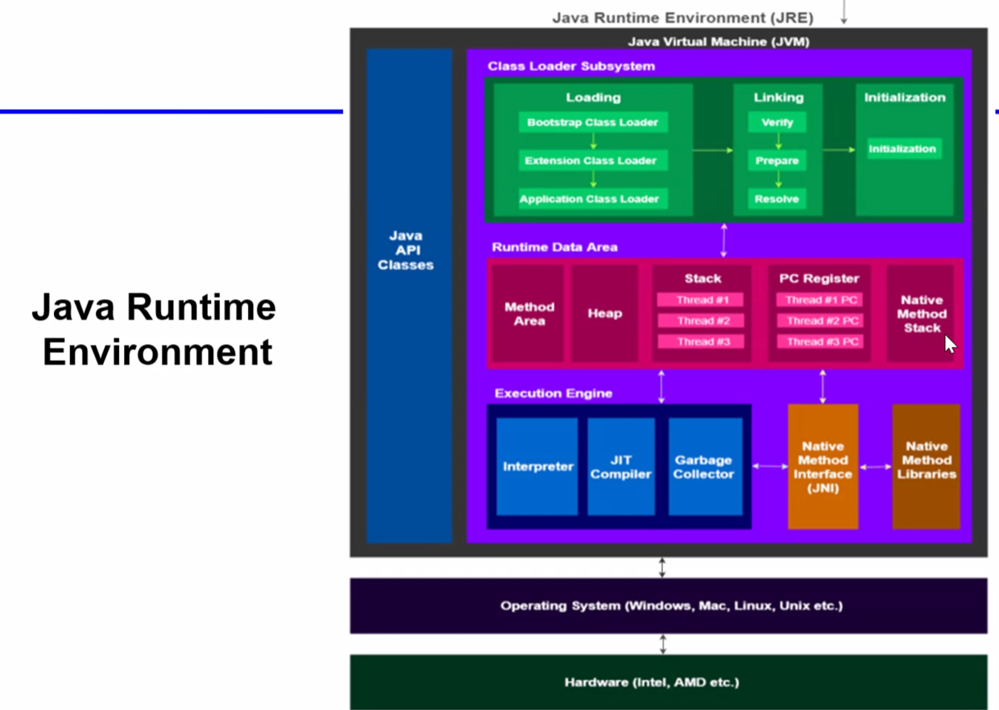

# 
- Using `new` memory is allocated on Heap, but refs exist on Stack
- String pool is part of Java heap
- Stack stores intermediate results for methods
- Each thread has its own thread. Especially take care on servers, since servers are intended to be 24x7
- Each thread has separate set of CPU registers and execution state but can share shared code and heap
- Method Area stores code (ctor, variables etc.)
- JNI (Java Native Interface) facilitates the interaction between Java and native code, the Native Method Area is where information about native methods is stored within the JVM
- Program counter is used by JVM the next instruction to be executed

# Portability vs Native Code Generation
The JVM provides runtime services such as memory management, garbage collection, and security checks during program execution & hardware abstraction and hence called virtual machine.
Compiled C++ programs produce standalone executables that do not rely on a separate runtime environment. They interact directly with the underlying operating system and hardware without an intermediary layer like a virtual machine.

# GC
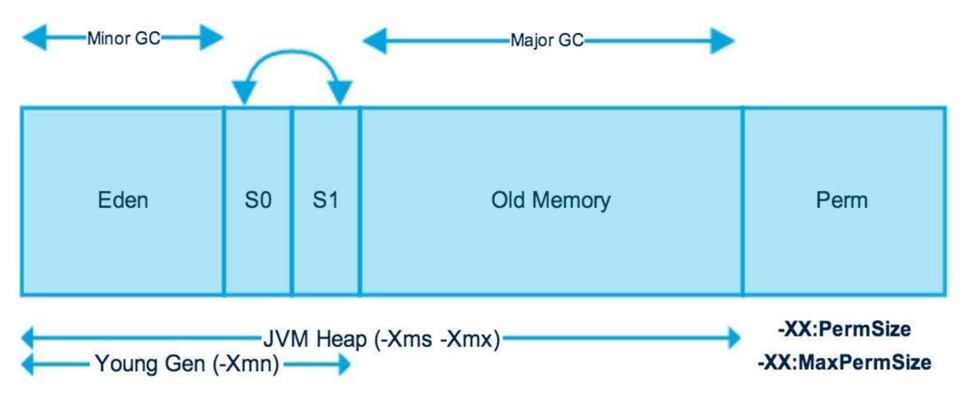

#
- `S0`, `S1` = servival memory and `Perm` = permanent memory and `Xms` = X min, `Xmx` = X max
#### From Java8, perm is now called `Metaspace` and now not part of heap and contains app metadata
- Memory pool used for immutable objects can belong to heap or perm memory
- New objects always created in nursery (aka young gen) (Eden, S0, S1)
  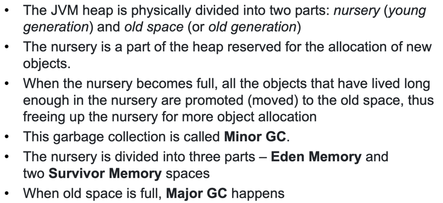
- How GC happens <br/>
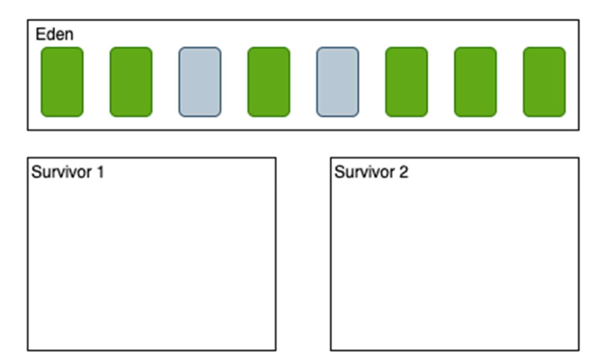
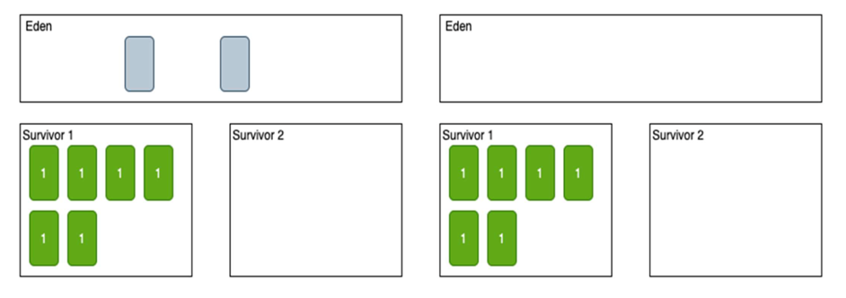
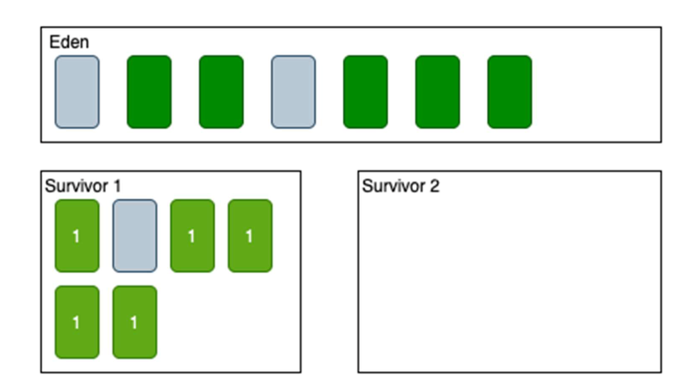
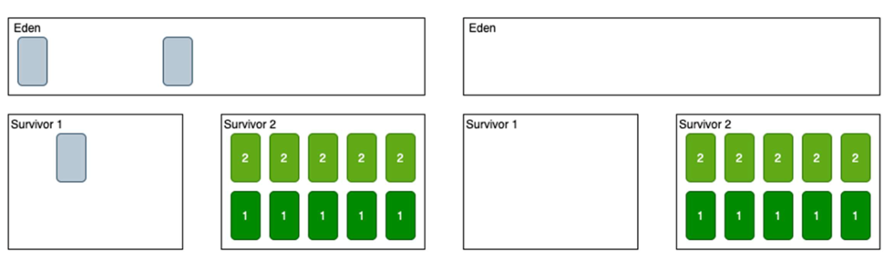
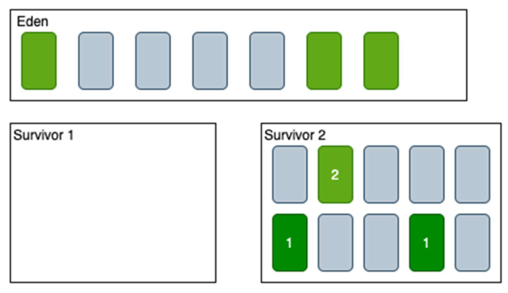
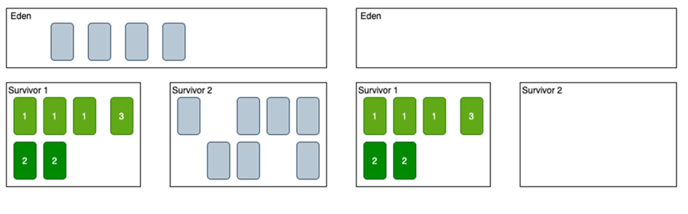

Objects are copied to S0 from Eden so that fragments are not created and Eden can start fresh altogether.

#
- If an object survives multiple GC cycles, it is long living and hence promoted to old gen heap area to avoid moving from Eden -> S0 -> S1
<br/>
- When orange line goes up/blue line goes down, that means GC is happening:
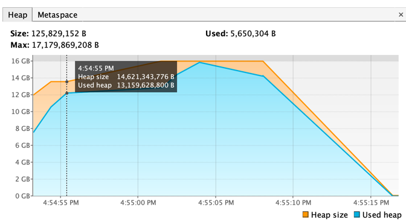
- 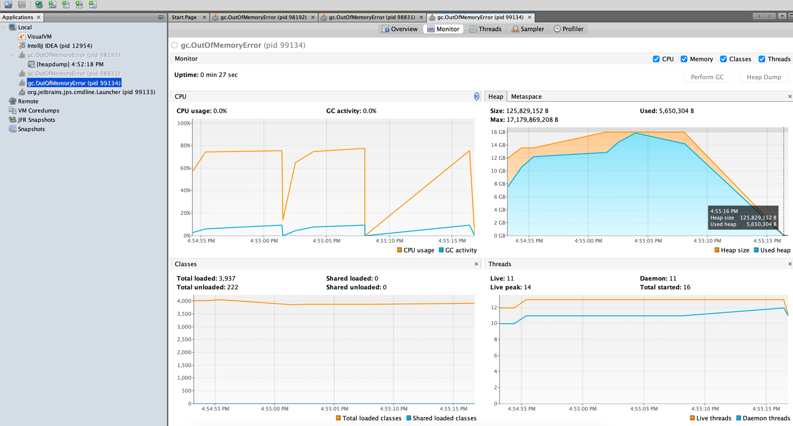

### Memory Sizes and Flags
Using CLI, pass as `java -Xms2560m MyCls` (sets the initial heap size to 2560 megabytes)
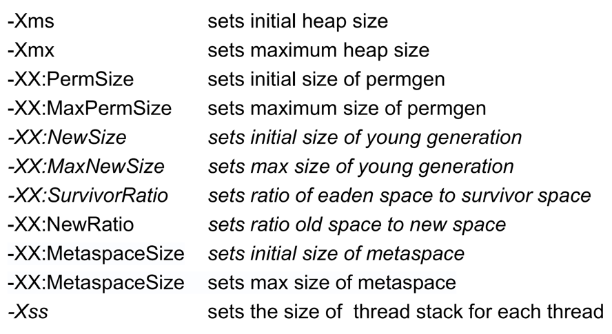
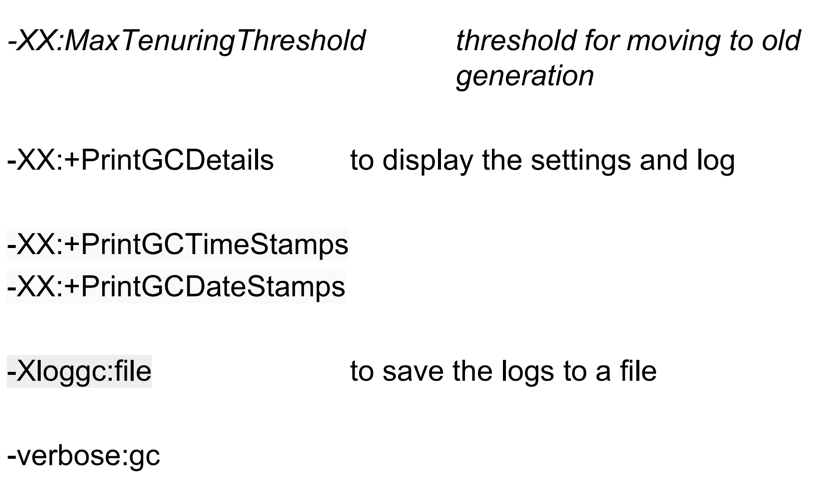
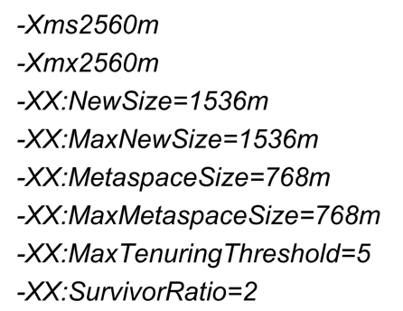

### Logs
Can heapdump in VisualVM to store heap info at a moment.
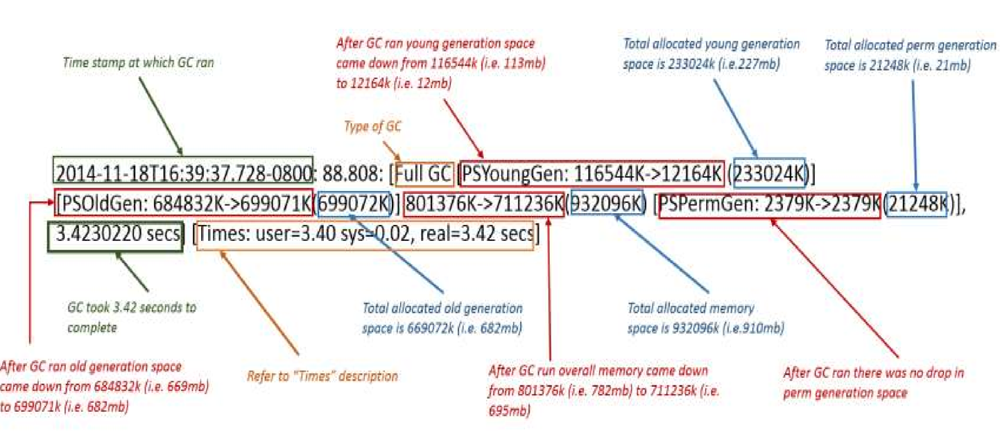

### How GC Works?
- There is no class unloading mechanism. So a class once loads remains in method area. And so do static variables. But if we create our own class loader, once that is removed, loaded classes are GCed
- JVM does not load class until needed. `import` does not mean loading, it is just for JVM to know location of class
- 4 Types of GC roots: local vars, static vars, JNI refs and active Java threads
- Once mark and sweep is done, compaction is done to remove fragments

### Types of GC
HotSpot JVM provides:
1. Serial GC: does mark-sweep and compaction. Only one thread
2. Parallel GC: Used to be JVM default till Java8. Uses multiple threads `-XX:ParallelGCThreads=<N>`, select `-XX:+UseParallelGC`. It uses Stop-the-World strategy
3. Concurrent Mark and Sweep (CMS): Does not use stop the world strategy but stops threads, if changes happen in heap
4. G1: Now default GC from Java9. Designed for multiprocessor, large memory systems. Divides heap in equal size spaces and firstly reclaims spaces which are mostly empty

### How to make object ready for GC
1. Create local var
2. Nullify ref
3. Reassign ref
4. Create anonymous ref


# Tips
1. Do not create object unless needed. And create object just before its usage
2. Make methods static which do not use instance data, so that they can be called as `Cls.method()` and no need to create obj of class (Object creation is heavy process, need to go up hierarchy to call all ctors)
3. Use right GC for your app - can have stop-the-world event? Want to use multiprocessor?
4. For one time use, create anonymous objects
```
public class AnonymousObjectExample {
    public static void main(String[] args) {
        // Creating an anonymous object of the Person class
        new Person().introduce(); // Anonymous object calling the method directly
    }
}

class Person {
    public void introduce() {
        System.out.println("Hi, I am Gaurav's anonymous person!");
    }
}
```
5. Release variable when no longer needed by setting to `null`
6. Use try-with-resource `AutoCloseable` interface resource management utility. So no need to close resources by making `finally` block